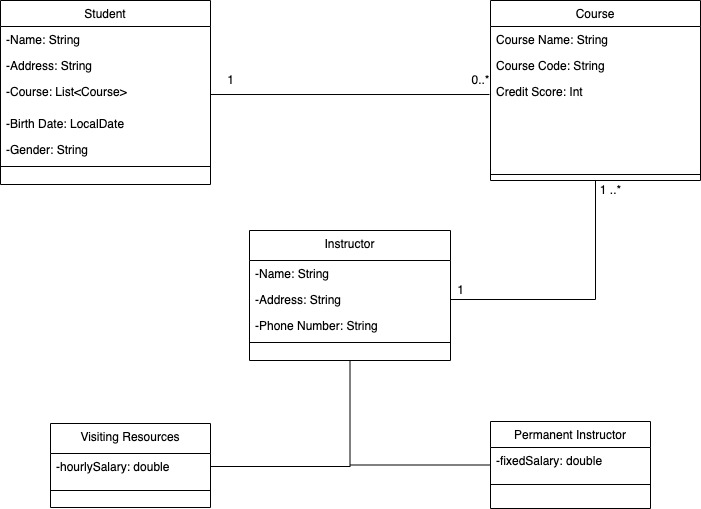

This is basic Java application which is School Management System.

I used hibernate and MySQL in this project.

Features:

- A Student can take zero or more courses.

- Instructors may teach at least one or more courses.

- A course can only be given by one Instructor.

- The program does basic CRUD processes.

